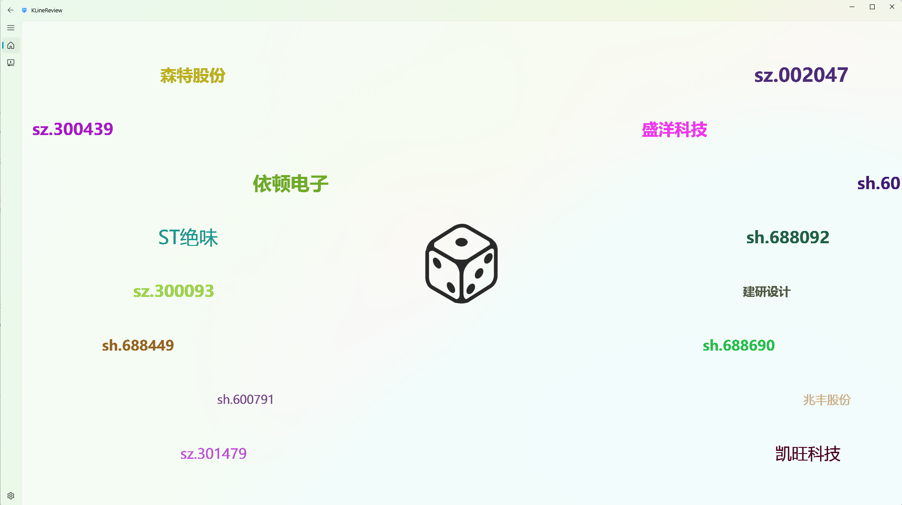
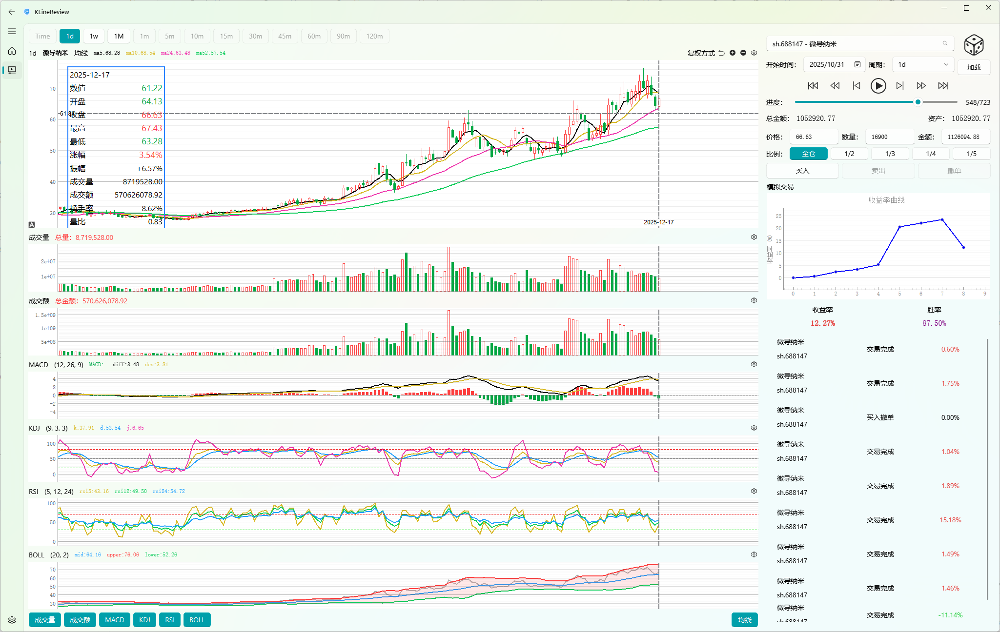
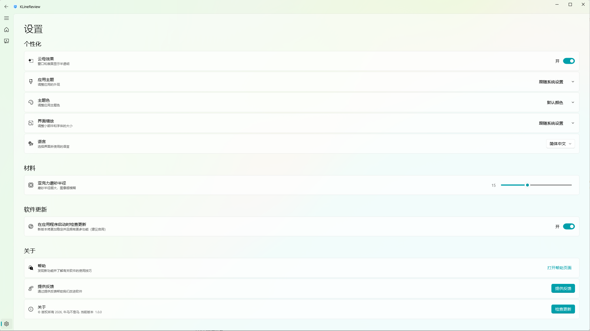

# KLineReview

**专注于K线回放复盘的PyQt5项目**

## 效果图







## 功能特点

- 获取股票历史数据
- 计算技术指标（MA、MACD、KDJ、RSI、BOLL等）
- 自定义指标计算
- k线回放复盘

## 安装

**确保已安装 Python 3.10 或更高版本。**

### 克隆代码到本地仓库

```bash
git clone https://github.com/Daydreamer-AI/KLineReview.git
cd KLineReview
```

### 创建并激活虚拟环境

venv:

```bash
cd ...
py -3.10 -m venv .venv
.venv\Scripts\activate
```

conda: 

```bash
conda create --name myenv python=3.10

conda activate myenv
```

### 安装依赖

```bash
pip install -r requirements.txt
```

## 使用示例

```bash
python ./src/main.py
```

程序需要联网：启动后从 Baostock 获取股票列表，复盘页按需拉取 K 线数据（Baostock 前复权数据约近三年）。

## 发布包构建（可选）

仓库内置 GitHub Actions 发布流程：向 `master`/`release/*` 推送 `vX.Y.Z` tag 后，会在 Windows/macOS 上自动打包 exe/dmg 并发布到 Releases（见 [.github/workflows/release.yml](.github/workflows/release.yml)）。

本地构建需要先安装 PyInstaller：

```bash
pip install pyinstaller
python packaging/make_icons.py
pyinstaller --noconfirm --clean packaging/KLineReview.spec
```

## 文档

详细文档请参阅 [docs/](docs/) 目录。

## 反馈与贡献

欢迎通过 [Issues](https://github.com/Daydreamer-AI/KLineReview/issues) 提交问题和建议。

## 许可证

本项目采用 GNU GPL-3.0 许可证，因为项目内置了同样为 GPL-3.0 的 qfluentwidgets 控件库。详情请参阅 [LICENSE](LICENSE) 与 [THIRD_PARTY_NOTICES.md](THIRD_PARTY_NOTICES.md)。

注意：qfluentwidgets 上游对**商用**场景要求另行购买商业授权（见 [PyQt-Fluent-Widgets](https://github.com/zhiyiYo/PyQt-Fluent-Widgets)）。

## 引用

### AKShare

AKShare 项目地址：https://github.com/akfamily/akshare

### Baostock

Baostock 项目地址：https://pypi.org/project/baostock/

### qfluentwidgets

qfluentwidgets 项目地址：https://github.com/zhiyiYo/PyQt-Fluent-Widgets（本项目已将其控件源码内置至 `src/gui/qt_widgets/MComponents/qfluentwidgets`）
