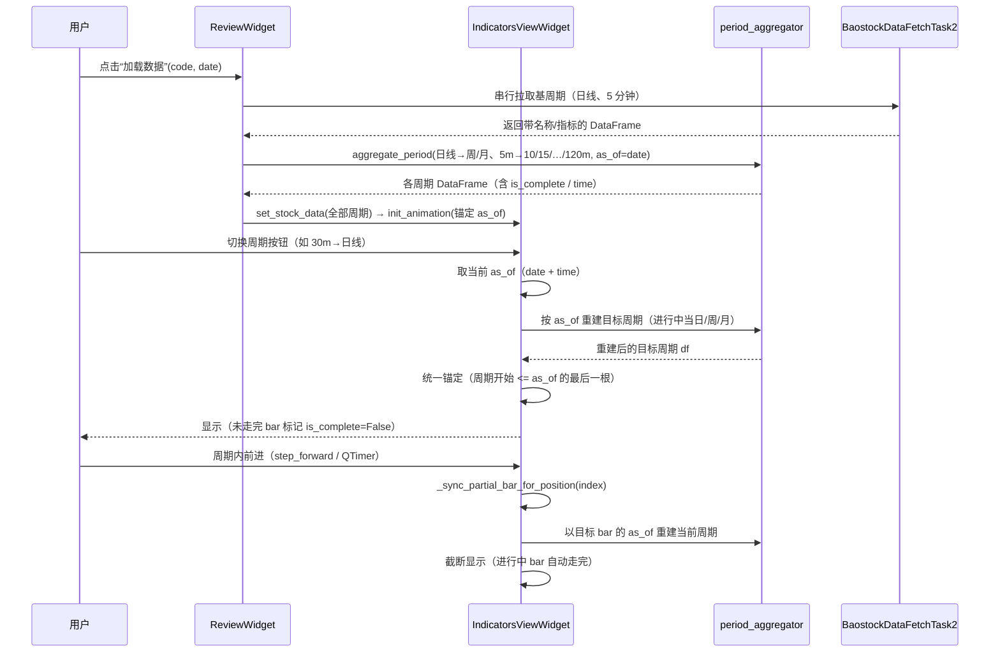

# 复盘周期切换与聚合设计（基周期聚合 + 统一锚定 + 进行中/自动走完）

> 适用范围：复盘页（ReviewWidget）的周期数据加载、跨周期切换、进行中（未走完）bar 的
> 表示与自动补全。对应需求文档：
> `docs/需求文档/v1.0/复盘/20260825-复盘周期切换通用化-基周期聚合与锚定统一.md`、
> `docs/需求文档/v1.0/复盘/20260825-分钟级周期处理与自定义周期扩展.md`。
> 本文为“面向开发者的实现说明”，读完应能回答：数据从哪来、怎么变成各级别 K 线、
> 切换时怎么定位、未走完数据怎么表示与补全。

## 1. 背景与核心问题

Baostock 各周期接口只返回“完整周期”bar：

- 日线：工作日 18:00 后更新当天数据；
- 周线/月线：每周/每月最后一个交易日收盘后才返回当周期；
- 分钟线：实测只有 5/15/30/60 可返回数据，且历史范围有限（部分股票自当年 1 月起）；
  1/3/10/45/90/120 分钟返回空。

因此复盘场景有两个天然矛盾：

1. **复盘到“周中/盘中”时，Baostock 没有对应周期的“部分 bar”**（如周一~周三的周线、
   09:30-11:00 的日线）。必须由更细的基周期（日线、5 分钟）**本地聚合**生成进行中 bar。
2. **同一份数据在不同复盘位置看到的“完整性”不同**：位置在周三，当周就是部分周；
   位置走到周五，当周才完整。所以各级别数据不能只生成一次，而要**随复盘位置重建**。

## 2. 总体架构与数据流

```text
远程 Baostock（只拉基周期：日线 + 5 分钟）
        │  BaostockDataFetchTask2（串行任务）
        ▼
ReviewWidget.load_data(code, date)
        │  _on_all_periods_loaded()
        │    ├─ 基周期（DAY / MINUTE_5）直接注入
        │    ├─ 日线基周期统一带 time（_normalize_day_base）
        │    └─ 上级周期由 aggregate_period 本地聚合（10/15/30/45/60/90/120 分、周、月）
        ▼
IndicatorsViewWidget.set_stock_data(code, {所有周期: df})
        │  切换时（周期按钮）：
        │    slot_period_button_clicked
        │      ├─ _refresh_derived_period_data(目标周期, 当前as_of)  # 按当前位置重建目标周期
        │      ├─ init_animation(..., b_init=False)                  # 统一锚定
        │      └─ update_chart                                       # 截断显示
        │  周期内前进时：
        │    step_forward / QTimer
        │      └─ update_chart → _sync_partial_bar_for_position      # 进行中bar随位置自动走完
        ▼
K 线 / 指标图（PyQtGraph）
```

关键原则：**远程只拉基周期；所有上级周期都是“按当前复盘位置 as_of 重建”的派生数据**；
视图维护一份“注入时的原始基周期”（`_base_stock_data`），重建不污染聚合与重复加载。

## 3. 周期模型（manager/period_manager.py）

`TimePeriod` 为枚举，值即周期标识：`5m/10m/15m/30m/45m/60m/90m/120m/1d/1w/1M...`。

- 本期固定分钟集合：**5/10/15/30/45/60/90/120**（均为 5 的倍数）；
- 数据层已支持但 UI 未接线的自定义级别：`7m/25m/2d/3d/2w/2M/3M/6M/12M`（枚举成员、标签、
  排序已就绪；聚合器按倍数通用处理）；
- 周期排序（`_period_order`）用于 `<`/`>` 比较（如判断“是否比日线更长”）。

扩展一个新周期的最小改动：

1. `TimePeriod` 增加枚举成员（如 `MINUTE_17 = '17m'`）；
2. 补齐 `get_chinese_label` / `from_label` / `get_number_label` /
   `from_minute_number_label` / `is_minute_level` / `_period_order` 映射；
3. 聚合器无需改动（按 `period_start_key` 通用处理）；
4. 需要展示时：`IndicatorsViewWidget.ui` 加按钮 + `init_ui` 接线 +
   `_DEFAULT_LOAD_PERIODS`（复盘页）加入。

## 4. 周期边界规则（period_aggregator.py）

所有周期统一用两个函数描述边界：

- `period_start_key(period, ts)`：bar（以结束时刻 ts 标注）所属周期的**开始时刻**；
- `period_end_key(period, ts)`：该 bar 的**名义结束时刻**（用于“是否走完”判断）。

### 4.1 分钟级：A 股交易时段切槽

A 股两段连续竞价时段：**09:30-11:30、13:00-15:00**。目标分钟数 N 的槽位从每段起点切起，
最后一槽可能不足 N（尾段）。

槽位归属规则：base bar 以“结束时刻”标注，bar 区间为 `[start, end)`；归属到
`slot_start < bar_end <= slot_end` 的槽。实现上用
`elapsed = bar_end - 时段起点`，`idx = max(0, (int(elapsed) - 1) // N)` 定位槽位。

示例（5 分钟 → 10 分钟，上午）：

| 5m bar 结束 | 归属 10m 槽 | 槽标签（组内最后 bar 时刻） |
| --- | --- | --- |
| 09:35、09:40 | 09:30-09:40 | 09:40 |
| 09:45、09:50 | 09:40-09:50 | 09:50 |
| … | … | … |

**跨午休不分组错误**：120 分钟由 5 分钟聚合时，上午 24 根 5m → 一根 11:30；下午 24 根 → 一根 15:00。
若用“结束时刻 - 周期时长”分组，10:30-11:30 的 60m bar 会算出 08:30 的错误起点，跨午休即错。

### 4.2 日线及以上：倍数分组

- 日线：1 日 = 当日；2/3 日线按自然日倍数分组；
- 周线：1 周 = 周一（ISO 周）；2 周线按 14 日网格（对齐周一）；
- 月线：1 月 = 当月 1 日；2/3/6/12 月线按月份倍数；
- 季线/年线同理取季度/年度首日。

### 4.3 bar 标签与 is_complete

- bar 日期标签 = **该周期内最后一根基周期 bar 的时刻**（进行中时即 as_of，走完后即周期最后交易日）；
- `is_complete = 名义结束时刻 <= as_of`；聚合器输出每根 bar 的 `is_complete` 列；
- 所有周期输出均带 `time` 列（完整 bar = 最后交易日 15:00:00，进行中 bar = as_of），
  用于“进行中时间跨周期传播”（见第 7 节）。

### 4.4 部分重建（aggregate_period 的 as_of 参数）

`aggregate_period(base_df, period, as_of)` 对**包含 as_of 且未走完**的周期组：

1. 只取 as_of 之前的基周期数据重新聚合（分钟级按时间比较；日线及以上按日期比较，兼容带 time 的基周期）；
2. 该组标记 `is_complete=False`；其余组保持完整（供播放前进时展示“未来”bar）。

## 5. 统一锚定规则（indicators_view_widget.py）

切换/加载的目标周期定位规则只有一条：

> 找到“周期开始时刻 <= as_of”的**最后一根** bar（进行中 bar 也包含）。

- 日线及以上：`period_start_key(period, bar日期) <= as_of`；
- 分钟级：限定 as_of 当日，且 `槽位开始时刻 < as_of`（bar 区间 `[start, end)`，
  as_of 恰为某根 bar 起始时刻时属于上一根 bar，避免锚到“尚未发生的下一根”）。

示例：

- 复盘周三 2026-08-19 切周线：当周（周一 08-17 开始）被选中 → 显示周一~周三的部分周；
- 复盘周五切周线：当周完整周被选中；
- 30 分钟位置 10:30 切 5 分钟：10:30 归属 10:25-10:30 这根（`start < as_of`），不会锚到 10:30-10:35。

### 5.1 数据未覆盖时的处理

- **周期切换**：目标周期数据未覆盖当前复盘位置（如复盘日期早于分钟数据起点）→
  **回退到来源周期**并告警，位置不漂移；
- **初始加载**：目标数据未覆盖 as_of → 回退到目标数据起始位置并出图（保证能看）。

## 6. 进行中 bar 与“自动走完”

### 6.1 切换回日/周/月时当日重建（_build_partial_day_df）

分钟盘中切回日线时，日线 bar 不能直接用远程完整当日，而要按 as_of 用 5 分钟基周期重建：

- 当日 open = 第一根分钟 open、high/low = 极值、close = as_of 所在分钟收盘、
  volume/amount/turnover = 求和；
- `is_complete = as_of >= 当日最后一根分钟 bar（收盘）`；
- 重建后重算指标（MA/MACD/KDJ/RSI/BOLL/涨跌幅），保证“as-of 语义”；
- 周/月聚合以“进行中当日”为基，未走完的当日不会把未来数据带入周/月 bar。

### 6.2 周期内前进自动走完（_sync_partial_bar_for_position）

日线/周线/月线/分钟级数据都是“按切换时刻的 as_of 重建”的快照；周期内前进时，
`update_chart` 会先调用 `_sync_partial_bar_for_position(index)`：

1. 当前周期数据若含 `is_complete=False` 的 bar；
2. 以“目标索引 bar 的 time/date”作为新的 as_of；
3. 重新调用 `_refresh_derived_period_data` 重建当前周期；
4. 用重建后的数据截断显示。

效果：日线(partial 03-11)前进到 03-12 后，03-11 自动恢复全天 OHLCV、
`is_complete=True`；周线/月线同理（标签随最后交易日更新，如 03-11→03-13）。

## 7. 进行中时间跨周期传播

链路：30 分钟(10:30) → 日线(partial) → 周线(partial) → 30 分钟，要求仍锚定 10:30。

实现要点：

1. 日线基周期加载时统一带 `time`（完整日 `YYYY-MM-DD 15:00:00`，见 `_normalize_day_base`）；
2. 聚合器对所有周期输出 `time` 列（周/月 bar 的 time = 组内最后基 bar 时刻，进行中即 as_of）；
3. 切换取“当前 as_of”时按“是否存在 time 列”取值：分钟/日/周/月都返回完整
   `date + time`；`init_animation` 判断 `source_has_time`（时间字符串含空格）后
   直接用精确时间作为 as_of，否则分钟目标回退到当日 15:00。

## 8. 切换时序与状态（示例）



关键状态说明：

| 状态/数据 | 说明 |
| --- | --- |
| `as_of` | 复盘基准时刻（date + time），所有重建与锚定的唯一依据 |
| `is_complete` | bar 是否已走完（名义结束时刻 <= as_of） |
| `_base_stock_data` | 注入时的原始基周期数据，重建/聚合不污染它 |
| `dict_stock_data` | 当前各周期展示数据（切换/前进时可能被重建覆盖） |
| `dict_period_process_data` | 各周期当前索引与日期时间（切换时取 as_of 用） |

## 9. 关键文件与函数索引

| 文件 | 职责 | 关键函数 |
| --- | --- | --- |
| `src/processor/period_aggregator.py` | 通用周期聚合 | `aggregate_period`、`period_start_key`、`period_end_key`、`minute_slot_bounds`、`get_minute_slot_intervals` |
| `src/manager/period_manager.py` | 周期枚举与映射 | `TimePeriod`（成员/标签/排序/`is_minute_level`） |
| `src/gui/qt_widgets/MComponents/review_widget.py` | 复盘加载链路 | `load_data`、`_on_all_periods_loaded`、`_normalize_day_base`、`_start_period_fetch_chain` |
| `src/gui/qt_widgets/MComponents/indicators/indicators_view_widget.py` | 注入/锚定/切换/动画 | `set_stock_data`、`init_animation`、`_get_anchor_matching_indices`、`_refresh_derived_period_data`、`_build_partial_day_df`、`_sync_partial_bar_for_position`、`get_time_intervals_for_period` |
| `src/thread/baostock_data_fetch_task.py` | 远程基周期拉取 | `BaostockDataFetchTask2.execute` |

## 10. 已知限制与 TODO

- Baostock 分钟数据历史范围有限（实测部分股票自当年 1 月起），更早日期切分钟级会回退保持原周期；
- 1 分钟数据源（AKShare/TuShare/券商）未接入：接入时把 1 分钟加入基周期即可；
- 非 5 倍数自定义周期与 2/3 日线、2 周线、2/3/6/12 月线：数据层已支持，UI 接线留待后续；
- 周/月“名义结束日”以基周期数据最后交易日近似，严格交易日历（节假日）判断留待后续；
- 分钟 bar 悬浮标签目前只显示日期，未显示时间（既有行为）。

## 11. 典型场景速查

| 场景 | 预期行为 |
| --- | --- |
| 复盘到周三切周线 | 显示周一~周三的部分周（is_complete=False） |
| 复盘到周五切周线 | 显示完整周 |
| 30 分钟盘中 11:00 切回日线 | 当日 bar 只含 09:30-11:00 数据，is_complete=False |
| 日线(partial)内前进 | 当日 bar 随位置前进自动走完（成交量恢复全天） |
| 30m(10:30)→日线→周线→30m | 仍锚定 10:30（时间跨周期传播） |
| 复盘日期早于分钟数据起点切分钟 | 回退保持原周期并告警 |
| 分钟内部切换（如 5m→10m） | 锚定包含当前时刻的槽位 |

## 12. FAQ（常见问题）

**Q1：为什么周线标签是 03-11 而不是周五（03-13）？**

bar 标签 = “该周期内最后一根基周期 bar 的时刻”。周中复盘时当周只走到周三，标签即 03-11，
并标记 `is_complete=False`；复盘位置前进到周五/下一周后，该周自动走完，标签更新为最后交易日
（03-13 或周五）。标签随“进行中/自动走完”变化是预期行为。

**Q2：为什么 30 分钟盘中切回日线，当日 bar 是“未走完”的？**

日线 bar 不再直接使用远程完整当日，而是按 as_of 用 5 分钟基周期重建：只含已发生分钟数据，
`is_complete=False`，避免把“未来”的下午数据提前展示。

**Q3：为什么复盘日期早于分钟数据起点时，点击分钟按钮没反应？**

目标周期数据未覆盖当前复盘位置，切换会**回退保持原周期**并记录告警（日志可见），避免复盘位置漂移。
初始加载时则回退到数据起始位置并出图。

**Q4：为什么日线/周线/月线数据里多了一个 `time` 列？**

为了“进行中时间跨周期传播”：分钟盘中切到日/周/月再切回分钟级时，需要沿用原盘中时刻
（如 10:30），不能回退到 15:00。完整 bar 的 time = 最后交易日 15:00:00，进行中 bar 的 time = as_of。

**Q5：为什么 120 分钟一天只有 2 根、45 分钟一天 6 根？**

分钟聚合按 A 股两段交易时段（09:30-11:30、13:00-15:00）切槽：120 分钟 = 每段 1 根（共 2）；
45 分钟 = 每段 120÷45=2.67 → 2 整槽 + 1 尾段（共 3，一天 6）。尾段不足一个周期是预期行为。

**Q6：为什么“自动走完”后成交量/收盘会变？**

进行中 bar 的数据只到 as_of；前进到下一根 bar 后，`_sync_partial_bar_for_position` 以新位置
重建当前周期，之前的进行中 bar 恢复为完整周期数据（成交量/收盘变为全天值）。

**Q7：切换后为什么看不到后面的数据？**

`update_chart` 只截断显示到锚点（`df.iloc[:index+1]`），锚点之后是“未来”bar，
需要播放/前进才会逐步出现。
